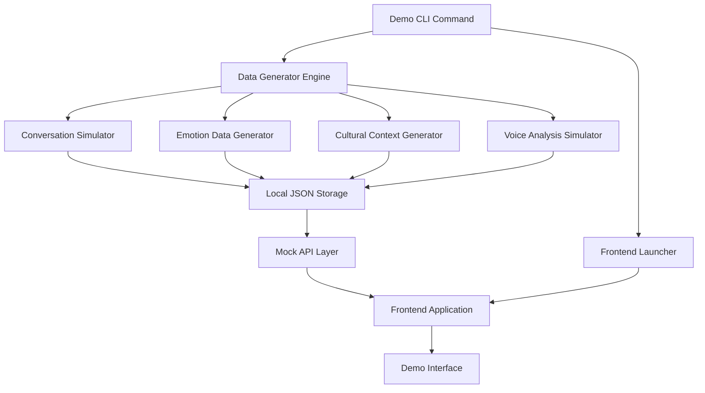

# Design Document: Demo Data Generator

## Overview

The Demo Data Generator is a comprehensive testing and demonstration system for the ResonaAI platform. It creates realistic test data, provides local storage capabilities, and launches the frontend application to showcase the autonomous building software's capabilities. The system generates culturally-aware conversations, emotional patterns, and voice analysis data that demonstrates all key ResonaAI features without requiring a full database setup.

## Architecture

The Demo Data Generator follows a modular architecture with clear separation between data generation, storage, and presentation layers:



## Components and Interfaces

### 1. Data Generator Engine

**Location:** `scripts/demo_data_generator.py`

The core orchestrator that coordinates all data generation activities.

**Key Responsibilities:**
- Coordinate data generation across all modules
- Manage data consistency and relationships
- Handle configuration and parameters
- Provide progress reporting and logging

**Interface:**
```python
class DemoDataGenerator:
    def __init__(self, config: DemoConfig)
    def generate_all_data(self) -> GenerationResult
    def clear_existing_data(self) -> bool
    def validate_generated_data(self) -> ValidationResult
```

### 2. Conversation Simulator

**Location:** `scripts/generators/conversation_simulator.py`

Generates realistic conversation flows with emotional progression and cultural context.

**Key Features:**
- Multi-turn dialogue generation
- Emotional arc progression (neutral → stressed → crisis → resolution)
- Code-switching between English and Swahili
- Cultural deflection patterns
- Crisis escalation scenarios

**Interface:**
```python
class ConversationSimulator:
    def generate_conversation_thread(self, scenario: ConversationScenario) -> ConversationThread
    def create_emotional_arc(self, start_emotion: str, target_emotion: str) -> EmotionalProgression
    def add_cultural_context(self, conversation: ConversationThread) -> ConversationThread
```

### 3. Emotion Data Generator

**Location:** `scripts/generators/emotion_generator.py`

Creates realistic emotion analysis data with confidence scores and feature vectors.

**Key Features:**
- 7-emotion model simulation (neutral, happy, sad, angry, fear, surprise, disgust)
- Confidence score generation with realistic distributions
- Voice-truth dissonance patterns
- Baseline tracking data over time
- Feature vector simulation (MFCC, spectral, prosodic)

**Interface:**
```python
class EmotionGenerator:
    def generate_emotion_analysis(self, text: str, context: EmotionalContext) -> EmotionResult
    def create_dissonance_pattern(self, text_emotion: str, voice_emotion: str) -> DissonanceResult
    def generate_baseline_data(self, user_id: str, sessions: int) -> BaselineData
```

### 4. Cultural Context Generator

**Location:** `scripts/generators/cultural_generator.py`

Generates culturally-aware scenarios and responses specific to East African communities.

**Key Features:**
- Swahili pattern recognition simulation
- Cultural deflection detection
- Traditional healing vs. modern therapy scenarios
- Family/community pressure situations
- Gender-specific cultural challenges

**Interface:**
```python
class CulturalGenerator:
    def generate_swahili_patterns(self) -> List[SwahiliPattern]
    def create_cultural_scenario(self, scenario_type: CulturalScenarioType) -> CulturalScenario
    def simulate_deflection_detection(self, conversation: str) -> DeflectionResult
```

### 5. Voice Analysis Simulator

**Location:** `scripts/generators/voice_simulator.py`

Simulates voice processing and analysis without requiring actual audio files.

**Key Features:**
- Mock audio feature extraction
- Voice-truth gap simulation
- Prosodic feature generation
- Speech pattern analysis
- Audio quality metrics

**Interface:**
```python
class VoiceSimulator:
    def simulate_audio_features(self, text: str, emotion: str) -> AudioFeatures
    def generate_voice_truth_gap(self, text_content: str, emotional_state: str) -> VoiceTruthGap
    def create_prosodic_features(self, speech_pattern: SpeechPattern) -> ProsodicFeatures
```

### 6. Local Storage Manager

**Location:** `scripts/storage/local_storage.py`

Manages local JSON file storage and retrieval for all generated data.

**Key Features:**
- Structured JSON file organization
- Data versioning and backup
- Incremental data loading
- Data integrity validation
- Fast lookup and indexing

**Interface:**
```python
class LocalStorageManager:
    def save_data(self, data_type: str, data: Dict) -> bool
    def load_data(self, data_type: str) -> Dict
    def clear_all_data(self) -> bool
    def validate_data_integrity(self) -> ValidationResult
```

### 7. Mock API Layer

**Location:** `scripts/api/mock_api.py`

Provides API endpoints that serve generated test data instead of connecting to real services.

**Key Features:**
- FastAPI-based mock server
- Compatible with existing frontend API calls
- Realistic response times and patterns
- Error simulation for testing edge cases
- WebSocket support for real-time features

**Interface:**
```python
class MockAPIServer:
    def start_server(self, port: int = 8001) -> None
    def stop_server(self) -> None
    def register_endpoints(self) -> None
    def simulate_processing_delay(self, endpoint: str) -> float
```

### 8. Frontend Launcher

**Location:** `scripts/launcher/frontend_launcher.py`

Manages the React frontend application startup and configuration.

**Key Features:**
- Automatic npm/yarn detection and installation
- Environment variable configuration
- Port management and conflict resolution
- Browser auto-launch
- Process monitoring and cleanup

**Interface:**
```python
class FrontendLauncher:
    def setup_environment(self) -> bool
    def start_frontend(self, port: int = 3000) -> Process
    def configure_api_endpoints(self, mock_api_url: str) -> bool
    def open_browser(self, url: str) -> bool
```

## Data Models

### Conversation Data Structure

```json
{
  "conversations": [
    {
      "id": "conv_001",
      "user_id": "user_001",
      "scenario": "academic_pressure",
      "messages": [
        {
          "id": "msg_001",
          "timestamp": "2024-01-12T10:00:00Z",
          "speaker": "user",
          "text": "Nimechoka na masomo, sijui nifanye nini",
          "emotion": {
            "detected": "sad",
            "confidence": 0.78,
            "voice_truth_gap": 0.23
          },
          "cultural_context": {
            "patterns": ["academic_stress", "swahili_expression"],
            "deflection_detected": false,
            "cultural_significance": "high"
          }
        },
        {
          "id": "msg_002",
          "timestamp": "2024-01-12T10:00:15Z",
          "speaker": "assistant",
          "text": "I understand you're feeling overwhelmed with your studies. That's a common feeling, especially during exam periods. Can you tell me more about what specifically is making you feel this way?",
          "emotion": {
            "tone": "empathetic",
            "confidence": 0.92
          },
          "cultural_adaptation": {
            "acknowledged_language_switch": true,
            "culturally_sensitive_response": true
          }
        }
      ],
      "emotional_arc": {
        "start_emotion": "neutral",
        "progression": ["neutral", "stressed", "sad", "hopeful"],
        "end_emotion": "hopeful",
        "crisis_level": "low"
      }
    }
  ]
}
```

### User Profile Data Structure

```json
{
  "users": [
    {
      "id": "user_001",
      "profile": {
        "age": 22,
        "gender": "female",
        "location": "Nairobi, Kenya",
        "primary_language": "Swahili",
        "secondary_language": "English",
        "cultural_background": "Kikuyu",
        "education_level": "university",
        "occupation": "student"
      },
      "baseline_data": {
        "voice_patterns": {
          "average_pitch": 180.5,
          "speech_rate": 145.2,
          "emotional_baseline": "neutral",
          "stress_indicators": ["pitch_elevation", "speech_acceleration"]
        },
        "emotional_patterns": {
          "dominant_emotions": ["neutral", "happy", "stressed"],
          "crisis_triggers": ["academic_failure", "family_pressure"],
          "coping_mechanisms": ["social_support", "prayer"]
        }
      },
      "session_history": [
        {
          "session_id": "sess_001",
          "date": "2024-01-12",
          "duration_minutes": 15,
          "emotional_state": "stressed",
          "topics_discussed": ["academic_pressure", "family_expectations"],
          "crisis_level": "low",
          "intervention_needed": false
        }
      ]
    }
  ]
}
```

### Cultural Context Data Structure

```json
{
  "cultural_patterns": [
    {
      "id": "pattern_001",
      "pattern": "nimechoka",
      "language": "swahili",
      "meaning": "I'm tired/exhausted",
      "emotional_weight": "medium",
      "cultural_significance": "Often used to express emotional exhaustion, not just physical",
      "deflection_indicator": false,
      "crisis_level": "low",
      "appropriate_responses": [
        "Acknowledge the exhaustion",
        "Explore underlying causes",
        "Offer culturally appropriate coping strategies"
      ]
    },
    {
      "id": "pattern_002",
      "pattern": "ni sawa tu",
      "language": "swahili",
      "meaning": "It's just okay/fine",
      "emotional_weight": "low",
      "cultural_significance": "Common deflection phrase to minimize problems",
      "deflection_indicator": true,
      "crisis_level": "medium",
      "appropriate_responses": [
        "Gently probe deeper",
        "Acknowledge the cultural tendency to minimize",
        "Create safe space for honest expression"
      ]
    }
  ]
}
```

## Correctness Properties

*A property is a characteristic or behavior that should hold true across all valid executions of a system-essentially, a formal statement about what the system should do. Properties serve as the bridge between human-readable specifications and machine-verifiable correctness guarantees.*

Based on the prework analysis, I've identified the following properties that need to be validated through property-based testing:

### Property Reflection

After reviewing all testable criteria from the prework analysis, I identified several areas where properties can be consolidated:

- **Data Generation Properties**: Multiple criteria about generating different types of data can be combined into comprehensive generation properties
- **Storage Properties**: File operations and data persistence can be consolidated into storage round-trip properties  
- **Integration Properties**: Frontend and API integration criteria can be combined into end-to-end properties
- **Simulation Properties**: Various simulation aspects can be unified into comprehensive simulation properties

### Core Properties

**Property 1: Data Generation Completeness**
*For any* demo data generation request, all required data types (user profiles, conversations, emotions, cultural context, voice analysis) should be generated with appropriate diversity and realism
**Validates: Requirements 1.1, 1.2, 1.3, 1.4, 1.5**

**Property 2: Local Storage Round Trip**
*For any* generated test data, storing then loading the data should produce equivalent structured content with valid JSON format
**Validates: Requirements 2.1, 2.2, 2.3, 2.5**

**Property 3: Data Cleanup Completeness**
*For any* existing test data, clearing the data should remove all generated files and leave the system in a clean state
**Validates: Requirements 2.4**

**Property 4: Frontend Integration Consistency**
*For any* frontend API request, the mock API should respond with appropriate test data that matches the expected schema and demonstrates relevant features
**Validates: Requirements 3.2, 3.3, 3.4, 3.5**

**Property 5: Service Orchestration Reliability**
*For any* demo launch command, all required services (mock API, frontend server) should start in the correct order and become accessible
**Validates: Requirements 3.1, 6.2**

**Property 6: Emotional Progression Realism**
*For any* generated conversation, emotional transitions should follow realistic patterns without abrupt or illogical jumps between emotional states
**Validates: Requirements 5.1, 5.3**

**Property 7: Cultural Context Authenticity**
*For any* generated cultural scenario, the content should include authentic East African cultural elements, appropriate Swahili patterns, and culturally-sensitive responses
**Validates: Requirements 5.2, 5.4**

**Property 8: Cross-Platform Compatibility**
*For any* supported operating system (Windows, Mac, Linux), the demo system should adapt configuration and execute successfully
**Validates: Requirements 6.5**

**Property 9: Demo Automation Completeness**
*For any* demo execution, all necessary test data should be generated automatically and the system should provide clear access instructions
**Validates: Requirements 6.1, 6.4**

## Error Handling

### Data Generation Errors

**Insufficient Diversity Detection:**
- Monitor generated data for lack of demographic diversity
- Retry generation with adjusted parameters if diversity thresholds not met
- Log warnings for potential bias in generated data

**Cultural Context Validation:**
- Validate Swahili patterns against known linguistic rules
- Check cultural scenarios for authenticity and sensitivity
- Reject generated content that could be culturally inappropriate

**Emotional Progression Validation:**
- Detect unrealistic emotional transitions (e.g., happy → suicidal without intermediate states)
- Validate emotional confidence scores are within realistic ranges
- Ensure crisis scenarios have appropriate escalation patterns

### Storage and File System Errors

**File System Permissions:**
- Handle read/write permission errors gracefully
- Provide clear error messages for permission issues
- Suggest alternative storage locations if needed

**Disk Space Management:**
- Check available disk space before generating large datasets
- Implement cleanup procedures for partial generation failures
- Provide storage usage estimates to users

**JSON Corruption Handling:**
- Validate JSON structure after writing files
- Implement backup and recovery for corrupted data files
- Provide data repair utilities for minor corruption issues

### Service Integration Errors

**Port Conflicts:**
- Detect and resolve port conflicts for mock API and frontend servers
- Automatically select alternative ports when defaults are unavailable
- Update configuration dynamically when ports change

**Process Management:**
- Handle service startup failures gracefully
- Implement timeout mechanisms for service initialization
- Provide process cleanup on system shutdown or errors

**API Compatibility:**
- Validate mock API responses match expected frontend schemas
- Handle version mismatches between generated data and frontend expectations
- Provide migration utilities for data format changes

### Cross-Platform Compatibility Errors

**Path Handling:**
- Use platform-appropriate path separators and conventions
- Handle long path limitations on Windows systems
- Resolve symbolic link issues on Unix-like systems

**Command Execution:**
- Adapt shell commands for different operating systems
- Handle differences in npm/yarn availability and behavior
- Manage environment variable syntax differences

**Browser Integration:**
- Handle different default browsers across platforms
- Provide fallback options when browser auto-launch fails
- Support headless operation for server environments

## Testing Strategy

### Dual Testing Approach

The Demo Data Generator will use both unit tests and property-based tests to ensure comprehensive coverage:

**Unit Tests:**
- Test specific data generation scenarios and edge cases
- Validate file system operations with known inputs
- Test service startup and shutdown procedures
- Verify cross-platform compatibility with mocked environments

**Property-Based Tests:**
- Validate data generation properties across randomized inputs
- Test storage round-trip properties with various data structures
- Verify service integration properties under different conditions
- Test emotional progression and cultural authenticity properties

### Property-Based Testing Configuration

**Testing Framework:** Hypothesis (Python)
- Minimum 100 iterations per property test
- Custom generators for realistic test data
- Shrinking enabled for minimal failing examples

**Test Tagging Format:**
Each property test will be tagged with: **Feature: demo-data-generator, Property {number}: {property_text}**

**Example Property Test Structure:**
```python
@given(conversation_scenario=conversation_scenarios())
def test_emotional_progression_realism(conversation_scenario):
    """Feature: demo-data-generator, Property 6: Emotional progression realism"""
    conversation = conversation_simulator.generate_conversation_thread(conversation_scenario)
    emotional_arc = conversation.emotional_arc
    
    # Verify no abrupt emotional jumps
    for i in range(len(emotional_arc.progression) - 1):
        current_emotion = emotional_arc.progression[i]
        next_emotion = emotional_arc.progression[i + 1]
        assert is_realistic_transition(current_emotion, next_emotion)
```

### Integration Testing Strategy

**End-to-End Demo Tests:**
- Full demo execution from command line to browser access
- Verification of all generated data types and their relationships
- Testing of complete user workflows through the demo interface

**Service Integration Tests:**
- Mock API and frontend communication validation
- Data consistency across service boundaries
- Error propagation and handling between components

**Cross-Platform Testing:**
- Automated testing on Windows, macOS, and Linux environments
- Validation of platform-specific configurations and adaptations
- Testing of different Node.js and Python versions

### Performance Testing

**Data Generation Performance:**
- Benchmark generation times for different data volumes
- Memory usage monitoring during large dataset creation
- Scalability testing for various demo sizes

**Service Startup Performance:**
- Measure time from command execution to demo readiness
- Optimize service initialization order and parallelization
- Monitor resource usage during startup phase

**Frontend Responsiveness:**
- Test frontend loading times with different data volumes
- Validate smooth user interactions with generated test data
- Monitor browser performance with simulated user sessions